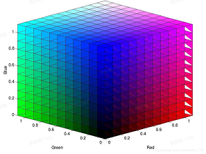

# image-palette

A Python implemented algorithm is used to extract the dominant color of an image.   
The C language version is also implemented.

图像调色板主要是获取图片中的主要颜色。可生成优化后的调色板，降低图像的颜色深度。基于调色板可用于图像压缩等应用。项目提供了Python和C++的算法实现。      
本项目主要使用两种主色调提取算法：   
1. 实现了使用颜色立方体进行主要颜色提取;   
2. 实现了一种改进的中值切割算法进行主要颜色提取。   
最后参考了Android Palette实现了集中六个不同模式的主要颜色提取方法。   

## 算法说明
1. 颜色立方体方案   
    - 基于图像彩色空间，构建颜色立方体color cube；
    - 统计color cube中的颜色直方图，对颜色直方图进行排序；
    - 计算最多颜色像素的color cube的平均颜色，作为图像的主色调。   
    

2. 改进的中值切割算法   
    假如你有任意一张图片，想要降低影像中的颜色数目到256色。将图片内的所有像素加入到同一个区域   
    对于所有的区域做以下的事：   
    - 计算此区域内所有像素的RGB三元素最大值与最小值的差。
    - 选出相差最大的那个颜色（R或G或B）
    - 根据那个颜色去排序此区域内所有像素
    - 分割前一半与后一半的像素到二个不同的区域（这里就是“中位切割”名字的由来）根据像素点个数分区域   
    - 重复第二步直到得到256个区域
    - 将每个区域内的像素平均起来，于是你就得到了256色  
    参考[中位切割演算法](https://en.wikipedia.org/wiki/Median_cut)   